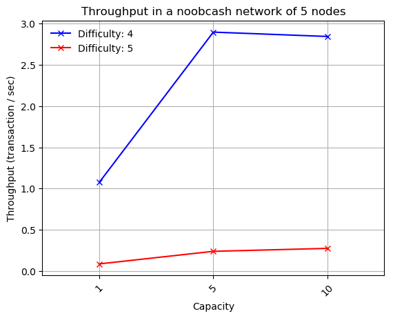
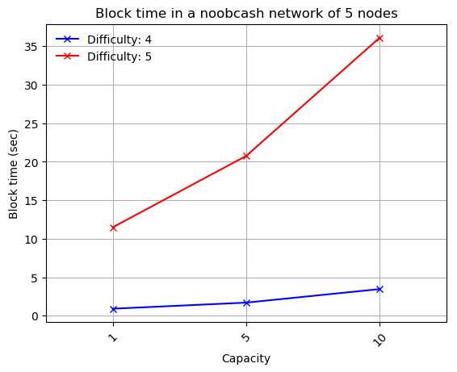
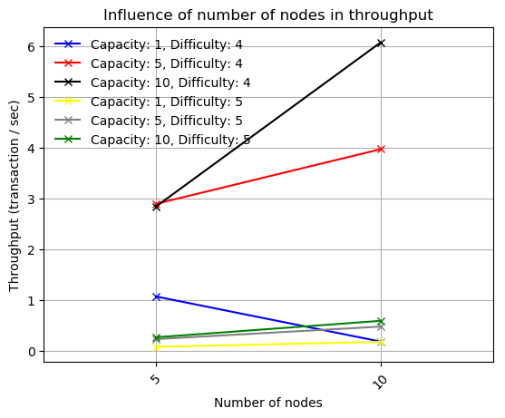
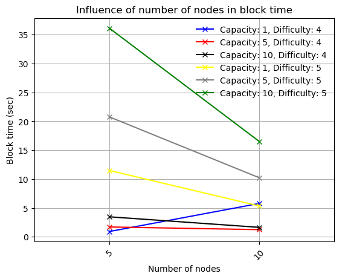

<p align="center">
    <br>
    
    <br>
<p>

<h3 align="center">
A simple blockchain system
</h3>


## About the project

Noobcash is a simple cryptocurrency system. It is a completely decentralized digital currency, without any need for central authority. The transactions made in the system are verified by a network of nodes and recorded in a public distributed ledger, the Noobcash Blockchain. The nodes in our system communicate via a peer-to-peer network using cryptography for the verification processes. 

## Demo
You can find an online demo of the project at the following address:

<p align="center"> <a href="https://snf-12208.ok-kno.grnetcloud.net/" alt="Demo"> https://snf-12208.ok-kno.grnetcloud.net/ </a> </p>

You will be able to access all of the nodes, in order for you to be able to check the system's status and validity at any point.

> **_NOTE:_** In case more than one users are making transactions at the same time, you may notice different behaviour regarding a node's balance than expected. Be sure to check the node's transactions before reporting a problem. **You could also setup Noobcash locally for safer results.**

## Deliverables

1. A rest api that implements the functionality of noobcash and is placed in `src` directory.
2. A cli client placed in `src/tester.py`.
3. A web app in `webapp` directory.

## Setup/Usage

- Install all necessary requirements

    `pip install -r requirements.txt`

- Setup noobcash backend by running the rest api of n nodes.

    ```
    $ python src/rest.py --help
    usage: rest.py [-h] -p P -n N -capacity CAPACITY [-bootstrap]

    Rest api of noobcash.

    optional arguments:
      -h, --help          show this help message and exit

    required arguments:
      -p P                port to listen on
      -n N                number of nodes in the blockchain
      -capacity CAPACITY  capacity of a block

    optional_arguments:
      -bootstrap          set if the current node is the bootstrap
    ```
    
    > **_NOTE:_** The file `src/config.py` should contain the ip address of the bootstrap node and the variable LOCAL should change in case of running in a remote server. In addition, each execution of the code above represents a node in the system. You have to execute the code N times, where N is the number of nodes you will use for the system as specified while setting up the bootstrap node (which can only be set **once**).

- Run a CLI client:

     ```
     $ python src/client.py --help

    usage: client.py [-h] -p P

    CLI client of noobcash.

    optional arguments:
      -h, --help  show this help message and exit

    required arguments:
      -p P        port to listen on
    ```

    > **_NOTE:_** Each execution of the code above represents a CLI client for the corresponding node at the specified port P.

- Run the webapp:

    1. Update the local settings [file](webapp/webapp/local_settings.py)
    2. `$ python webapp/manage.py makemigrations`
    3. `$ python webapp/manage.py migrate`
    4. `$ python webapp/manage.py shell`

        Type the following in the interactive console:

        `exec(open('db_script.py').read())`

        which executes a script to populate the database with the default settings for the nodes.

        See [here](webapp/nodes.json) for the default settings.
    5. `$ python webapp/manage.py createsuperuser`
        
        Save the credentials you used because you will need them to log in to the webapp.
    6. `$ python webapp/manage.py runserver`
    
        You can visit the webapp at http://127.0.0.1:8000


## Technologies used

1. The rest api is written in Python 3.6 using the following libraries: 
    - Flask
    - Flask-Cors
    - pycryptodome
    - requests
    - urllib3.
2. The webapp is developed using Django 3.0.4 and Python 3.6

## Evaluation of the system

We evaluate the performance and the scalability of Noobcash by running the system in [okeanos](https://okeanos-knossos.grnet.gr/home/) and perform from each node 100 transcations to the system. The transactions are placed in `/test/transactions` and the scipt for executing them in `test/tester.py`. 


- Performance of the system

 <p float="left">  
    
  
 </p>
 
 - Scalability of the system
 
  <p float="left">  
    
  
 </p>


## Project Structure

- `src/`: Source code of the rest backend and cli client.
- `test/`: Files regarding the evaluation of the system.
- `webapp/`: Files about the web app.

## Contributors

Developed by

<p align="center">
    <a href="https://github.com/PanosAntoniadis"> </a>  <a href="https://github.com/Nick-Buzz"></a>  <a href="https://github.com/ThanosM97"></a>
<p>
    
as a semester project for the Distributed Systems course of NTUA ECE.
